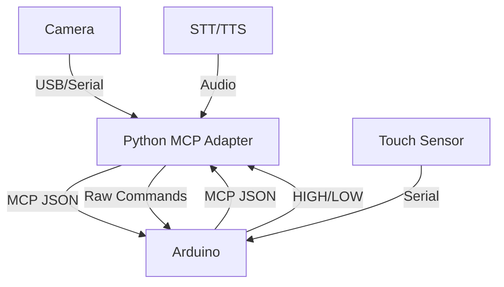

# Sarahbot MCP Architecture

## Overview
This repo implements an MCP-compatible control system for Sarahbot, with modular components for movement, audio, sensors, and vision.

## Data Flow

## Components

1. **Python MCP Adapter** (`mcp_adapter.py`)
   - Translates MCP ↔ Arduino commands.
   - Handles placeholders for TTS, STT, wakeword, and camera.

2. **Arduino Firmware** (`robot_control.ino`)
   - Parses MCP JSON and raw commands.
   - Controls motors, sensors, and audio.

3. **Placeholders**
   - `tts_placeholder.py`: Text-to-speech stub.
   - `stt_placeholder.py`: Speech-to-text stub.
   - `wakeword_listener.py`: Hotword detection stub.
   - `camera_serial_wake.py`: Camera trigger stub.
   - `look_placeholder.py`: Vision system stub.

## Setup
1. Connect Arduino via USB.
2. Run `python3 mcp_adapter.py` to start the MCP bridge.
3. Extend placeholders with real implementations.

---
**Dependencies:**
- Python: `pyserial`, `gTTS` (optional), `OpenCV` (future).
- Arduino: `ArduinoJson` library.
